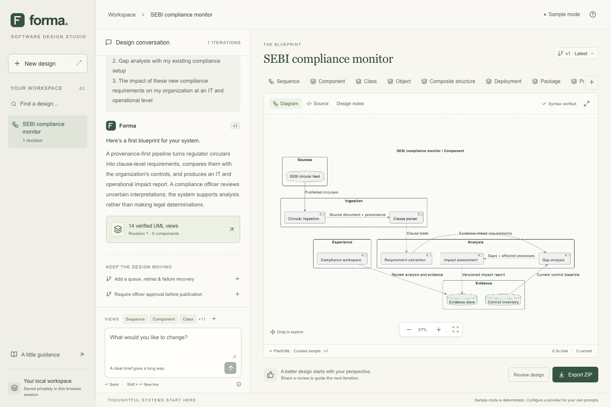

<div align="center">

# forma.
### Software, thoughtfully designed.

A conversational UML workspace: describe a system, explore a consistent blueprint, and refine it without losing the history.

**React + TypeScript · FastAPI · LangGraph / LangChain · PlantUML · SQLite · OpenPipe ART**

</div>



Built for the [OnFinance assignment](https://p.ip.fi/UiOJ). The deliverable is a **software-design chat platform**; the SEBI compliance pipeline is the supplied example design, not a claim that this repository implements regulatory ingestion or legal analysis.

## Try it in five minutes

Prerequisites: **Python 3.12**, **uv**, **Node.js 20+**, **Java 17+**, and **Graphviz**.

```bash
git clone https://github.com/ChiragArora31/forma-uml.git
cd forma-uml
./scripts/setup.sh
./scripts/start.sh
```

Open **http://127.0.0.1:8018**. No API key is needed for the explicitly labelled sample mode. Setup downloads a pinned MIT-licensed PlantUML release and verifies its SHA-256 checksum, installs locked dependencies, and builds the UI.

On macOS, Java and Graphviz can be installed with `brew install openjdk@21 graphviz`. Ensure the JDK is on `PATH`; `java -version` must work. Install uv using its [official instructions](https://docs.astral.sh/uv/getting-started/installation/).

Or, with Docker:

```bash
docker compose up --build
```

The app is exposed only on `127.0.0.1:8018`. The named `forma-data` volume preserves designs and feedback between container restarts.

## A short reviewer walkthrough

1. Click **Open the SEBI case study**. Sequence and component diagrams are the recommended starting pair. Use the diagram chooser to request any or all of the 14 UML views.
2. Explore the canvas: zoom, pan, fit, and expand. Open **Design notes** for requirements, assumptions, and component responsibilities.
3. Click **Add a queue, retries & failure recovery**, then send. A second revision retains the original requirements and adds durable asynchronous processing.
4. Click **Require officer approval before publication**, then send. The third revision adds an explicit approval boundary and guarded publication lifecycle.
5. Open **Changes**, then use the version picker to revisit the original design. Updates always build on the latest revision, with stale-write protection.
6. **Review design** with a rating and actionable comment. Feedback is linked to the exact revision and optional diagram; it is stored together with a durable ART outbox record.
7. Open **Source**, edit the PlantUML, and click **Check & preview**. Invalid syntax produces an error rather than a misleading success image. Source edits are local previews and do not overwrite saved revisions.
8. **Export ZIP** downloads SVGs, editable `.puml` files, the shared architecture JSON, and revision metadata. Reload the page and reopen the saved design to verify persistence.

Sample mode is a curated SEBI fixture with the two suggested updates. **It does not call an LLM and does not accept arbitrary designs or changes.** This makes the repository immediately inspectable without credentials while keeping the live-model boundary honest.

## Live generation

```bash
cp .env.example .env
```

Set the following in `.env` on the server, then restart the app:

```dotenv
FORMA_MODE=live
FORMA_API_KEY=your-provider-key
FORMA_MODEL=gpt-4.1-mini
# Optional: an OpenAI-compatible endpoint that supports tool calling
# FORMA_BASE_URL=https://api.openai.com/v1
```

Live mode accepts arbitrary software briefs and incremental or replacement specifications. The provider is accessed through LangChain; a LangGraph pipeline generates and validates one shared typed architecture, deterministically compiles the requested views, and validates each one using the actual PlantUML renderer. Invalid schema/reference output receives one bounded repair attempt. Provider errors never silently switch to sample mode.

The default is [GPT-4.1 mini](https://developers.openai.com/api/docs/models/gpt-4.1-mini), chosen for tool calling and non-reasoning latency. The model and endpoint are configurable. The interface is not coupled to this model. Credentials never go to the browser, exports, or Git.

## How the assignment is covered

| Ask | Implementation | Evidence |
| --- | --- | --- |
| New user submits a prompt and diagram types | Anonymous isolated session; validated input; streamed progress; atomic first revision | API tests and browser journey |
| Existing user updates the design | Previous architecture and review feedback enter the generation context; immutable numbered revisions; latest-version checks | Revision, conflict, retry, and provider tests |
| Feedback reaches ART / LangChain integration | Feedback + exact generation context committed with an outbox; `art.langgraph.init_chat_model` and `wrap_rollout`; separate trainable-policy rollout and training worker | Outbox and real ART SDK contract tests; [training guide](docs/training.md) |
| Generate and render UML in the UI | Deterministic PlantUML compiler, private local renderer, sanitized SVG canvas, source preview and exports | 14 real-engine cases, each tested across 3 revisions |
| Verify syntax | Typed schema/reference validation, compiler text escaping, actual engine validation; no partial revision if any diagram fails | Model, injection, renderer, and atomicity tests |
| Minimize latency | One design generation for all views; bounded parallel rendering; source-hash LRU cache and identical-render deduplication; SSE progress | Reported design/render/total timings; [architecture notes](docs/architecture.md) |
| Collect and store RL feedback | SQLite transaction with context, historical rating, diagrams, completion metadata, and retryable delivery/training states | Feedback and training tests |

The minimum request shape from the assignment works directly, including `sequential` as an alias for `sequence`. Request IDs are optional at the API boundary; the UI supplies them for idempotent retries. Existing conversations additionally require `conversation_id` and `base_revision`.

```json
{
  "prompt": "Describe a software system in at least 10 characters…",
  "diagram_types": ["sequential", "component"]
}
```

## Fourteen UML perspectives

| Structure | Behavior | Interaction (behavior subset) |
| --- | --- | --- |
| Class | Use case | Sequence |
| Object | Activity | Communication |
| Component | State machine | Interaction overview |
| Composite structure | | Timing |
| Deployment | | |
| Package | | |
| Profile | | |

All views share identifiers and domain facts. Composite structure uses UML2 component boundaries, part labels, and ports; communication uses object links with numbered messages; interaction overview uses activity control flow with named interaction references; profile uses stereotype and metaclass declarations. These composed views are described in the [notation notes](docs/architecture.md#notation-and-semantic-limits). **Syntax validation does not prove architectural or UML metamodel correctness.** Assumptions, example instance values, proposed deployment choices, and illustrative timing values remain visible for human review.

## Feedback and training

```bash
# No remote calls: inspect durable delivery status or export reviewed scenarios.
uv run python -m app.training inspect
uv run python -m app.training export --output .data/feedback-scenarios.jsonl

# Optional ART integration dependencies.
uv sync --frozen --extra training

# Requires configured judge credentials and a W&B Training account.
# This command performs paid inference/training on a remote ART backend.
uv run --extra training python -m app.training train --limit 2 --rollouts 4
```

Historical commercial-model responses are **not** fabricated into on-policy RL trajectories. The worker re-runs reviewed scenarios with ART's trainable policy, captures actual interactions and log probabilities through the LangGraph integration, scores fresh candidates, and submits groups to the ART backend. Sample outputs are excluded. A rating on the old output is context for evaluation, not a reward copied onto an unseen candidate. See [the training guide](docs/training.md) for the reward design, checkpoint receipt, deployment step, and operational limits.

Saving a review is immediately useful to the next live iteration through its context. It does **not** claim that model weights have already changed.

## Development and verification

```bash
# Backend / compiler / actual renderer
uv sync --frozen --extra training
uv run --extra training pytest -q
uv run ruff check app tests
uv run ruff format --check app tests

# UI
npm ci --prefix frontend
npm run typecheck --prefix frontend
npm run build --prefix frontend

# Two-server development (separate terminals)
uv run uvicorn app.main:create_app --factory --host 127.0.0.1 --port 8018
npm run dev --prefix frontend   # http://127.0.0.1:5178

# Browser journey + axe accessibility checks
cd frontend
npx playwright install chromium
npm run test:e2e
```

For the built production UI, set `FORMA_E2E_URL=http://127.0.0.1:8018` before running the browser tests. Tests use local fixtures, injected dependencies, and mocked provider transports; ordinary CI tests make no external model calls. Java/PlantUML integration tests require setup and are clearly marked.

See [verification notes](docs/verification.md) for the checks actually run, and [the API guide](docs/api.md) for request examples and endpoints.

## Scope and production boundaries

This is a take-home implementation intended for local review. Anonymous browser-session isolation is implemented; enterprise login, organization permissions, managed session expiry, and account recovery are deliberately outside scope. Use one Uvicorn worker: in-flight admission controls and the render cache are process-local. A production deployment needs durable job scheduling, proper identity, HTTPS, stronger quotas, tenant retention controls, and a managed rendering service.

The application stores designs and feedback in `.data/forma.sqlite3`. Clearing the browser's session cookie loses access to the anonymous workspace; the server records remain. Source previews are not saved edits. Feedback exports can contain proprietary designs; keep them in ignored `.data/` storage. The project includes no email content, credentials, or employer data.

The project implements UML design generation, not full compliance analysis, formal UML verification, or an already-trained specialized model. Live commercial generation and remote GPU training require separately configured credentials; verification status is documented rather than implied.

## Project map

```text
app/
  models.py       Typed system model, reference validation, request contracts
  provider.py     Live LangChain provider and bounded structured-output repair
  pipeline.py     LangGraph generation → compilation / validation
  compiler.py     Pure PlantUML projections for all fourteen diagram types
  renderer.py     SANDBOX rendering, limits, SVG sanitation, cache
  store.py        Session-owned revision persistence, feedback, durable outbox
  main.py         HTTP API, SSE, export, built UI serving
  training.py     Outbox export and ART trainable-policy training worker
frontend/src/     React workspace, canvas, source preview, reviews
scripts/          Checksum-verified setup and local launch
tests/            Backend, model, provider, renderer, and training checks
frontend/tests/   Complete browser journey and accessibility checks
docs/             Decisions, API, training, verification, screenshots
```

[Architecture](docs/architecture.md) · [API](docs/api.md) · [Training](docs/training.md) · [Verification](docs/verification.md)
