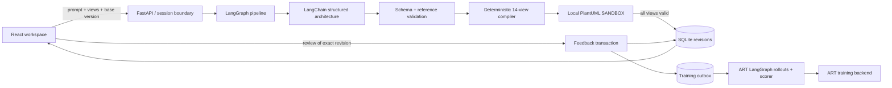

# Architecture and tradeoffs

Forma separates **a software design** from **its graphical projections**. A language model emits typed architecture data; application code determines the PlantUML grammar. The UI supervises the result without taking responsibility for generation, storage, or training.

## Why a shared typed model

Independent calls for every diagram create opportunities for the sequence diagram to describe one service while the component diagram describes another. Forma makes one design generation and projects it into every selected view. Components, entities, actors, interactions, lifecycle states, deployments, profiles, and timing examples are bounded and referentially validated.

A previous revision enters the model as structured context. The original system requirements persist as part of that context; a change request modifies them, and a replacement specification may deliberately supersede them. Prior human feedback also enters context as untrusted review data. The deterministic case study exercises two specific changes; only live mode accepts arbitrary updates.

The schema is richer than any one view. This costs output tokens for a two-diagram request, but gives a coherent source for future refinements and exports. A future optimization could progressively enrich only the requested projections while preserving shared IDs. That has not been hidden behind extra calls in this submission.

## Why PlantUML

The brief includes the full UML taxonomy. Mermaid is excellent for several common views, but its supported notation set does not directly cover all of these UML views. PlantUML supplies a mature text grammar for the core notations and allows explicit compositions for the less common views. SVG scales cleanly, supports readable export, and avoids a browser-side parsing dependency.

Rendering is local. No design is sent to a public diagram server. The model never writes PlantUML. It writes schema-constrained data; the compiler escapes text and uses controlled identifiers, arrow types, and blocks. The actual Java engine then renders every requested view. The output is structurally sanitized and displayed as an SVG image rather than injected active markup.

A generated design is saved **only if every selected view validates**. Failed rendering leaves previous revisions untouched. There is no fallback that quietly replaces an invalid diagram with an unrelated generic one.

## Notation and semantic limits

PlantUML directly supports sequence, class, object, component, deployment, use case, activity, state, and timing diagrams. Packages are represented by namespace groupings and dependency edges. Less common views use deliberate compositions:

- **Composite structure:** a UML2 component boundary contains typed part labels and boundary ports, with delegation connectors. It is a structural view of the selected component internals; it is not an XMI metamodel export.
- **Communication:** object participants are linked by numbered messages from the shared interaction model. Guard and loop conditions are labelled on the messages.
- **Interaction overview:** activity control flow connects named interaction references, with decision alternatives. The PlantUML activity syntax supplies the reference/procedure notation.
- **Profile:** stereotypes, tagged attributes, constraints, and labelled extensions to metaclasses are rendered with class/package primitives.

These views are syntax-validated renderings. Forma does not claim full UML 2.x metamodel conformance, validate an executable implementation, or prove that a model's architecture is correct. The notes panel makes the proposed decisions and assumptions reviewable. Object examples and timing numbers are marked illustrative. A compliance design does not invent SEBI obligations or treat a missing document as proof of a control gap.

## The four technical considerations

### 1. Render UML in the UI

SVG from the local renderer is stored alongside `.puml` source and the shared system model. The UI offers view selection, pan/zoom, fit, expansion, notes, revision comparison, source preview, and export. It performs no hidden regeneration on tab switching. Source editing is deliberately a preview operation: validated previews do not silently replace the saved model or its derived projections.

### 2. Control and verify syntax

1. Pydantic bounds and validates the model.
2. Reference checks reject missing IDs, duplicate IDs, inconsistent port parts, invalid lifecycle transitions, and unordered timing points.
3. Controlled code emits known PlantUML grammar, with sanitized user/model labels.
4. The engine must return a valid non-error SVG.
5. SVG sanitation removes scripts, external resources, event handlers, and unsupported elements.

Source preview additionally rejects preprocessing directives, macros, linked resources, embedded active content, and multi-diagram input. Java runs with `PLANTUML_SECURITY_PROFILE=SANDBOX`, headless mode, a fixed heap limit, timeout, and bounded concurrency. The downloaded jar is pinned by version and SHA-256. The dependency is MIT-licensed.

### 3. Minimize latency

- One structured architecture generation, not one model call per diagram.
- At most one repair attempt for schema/reference failures; provider errors remain visible.
- Render fan-out is asynchronous, bounded to three Java processes by default.
- A 128-entry LRU cache keyed by exact source hash avoids repeated render work.
- In-flight identical sources share a render task.
- SSE exposes design, rendering, and save phases immediately.
- Saved tabs and old revisions reuse existing artifacts.
- Feedback export/training never blocks the chat request.

Each revision records actual design, render, and total durations, plus cache hits. Cold Java startup is material; a long-running renderer service is a sensible next step if throughput or latency demands justify it. The current process-per-cache-miss design is simpler to reproduce and isolate in a take-home. The app does not label hand-picked sample timings as live-model performance.

### 4. Collect and store RL feedback

Feedback and its outbox are committed in one SQLite transaction. Each record retains the reviewed revision, its prior design, prompt, selected diagram types, source/SVG artifacts, generated architecture, provider trace and usage, normalized historical human rating, free-text correction, and optional diagram scope. The interactive API never calls a training backend.

Delivery and training status are explicit: `queued`, `exported`, `training`, `trained`, or `needs_reconciliation`. Exporting data is not training. An on-policy ART rollout re-runs the scenario on the trainable model and scores the new completion; the old commercial-model completion is not misrepresented as one. Checkpoint promotion is a separate, explicit deployment step. See [training.md](training.md).

## Storage and session boundaries

SQLite uses WAL and foreign keys. Immutable revisions have unique conversation/version and request-ID constraints. Optimistic version checks run inside an immediate transaction. The UI supplies a stable request ID for retries of the same generation; an ID reused with different content is rejected. A reconnect can replay an already-saved result.

Conversations are scoped by a cryptographically random, HttpOnly, SameSite=Strict session cookie. API reads, updates, reviews, and downloads enforce the owner boundary. A custom mutation header and no permissive CORS prevent cross-origin browser writes. API responses use `Cache-Control: no-store`; the built UI has a restrictive CSP.

This is anonymous session isolation, not a full account system. Run one API worker; cache, in-flight admission, and rate counters are local to that worker. Global generation concurrency, one active generation per owner, bounded source size, render timeouts, and request-rate limits protect the intended local-review use. Production needs real login, shared quotas, durable jobs, retention controls, and a separately managed renderer.

## Important failure behavior

| Failure | Behavior |
| --- | --- |
| Empty/invalid request | HTTP 422; no generation |
| Unknown diagram alias | HTTP 422 |
| Missing/foreign session | 401 or 404 |
| Stale base revision | 409; no overwrite |
| Duplicate completed request | Replay the exact saved revision |
| Schema/reference inconsistency | One repair attempt; then visible error |
| Provider timeout/error | Visible error, no sample fallback |
| Any failed render | No partial revision |
| Cancelled generation | Render tasks/processes are cancelled; a save that already completed may appear on reload |
| Feedback delivery failure | Durable context remains retryable |
| Unknown remote training outcome | `needs_reconciliation`; never blindly re-submit a potentially completed update |
